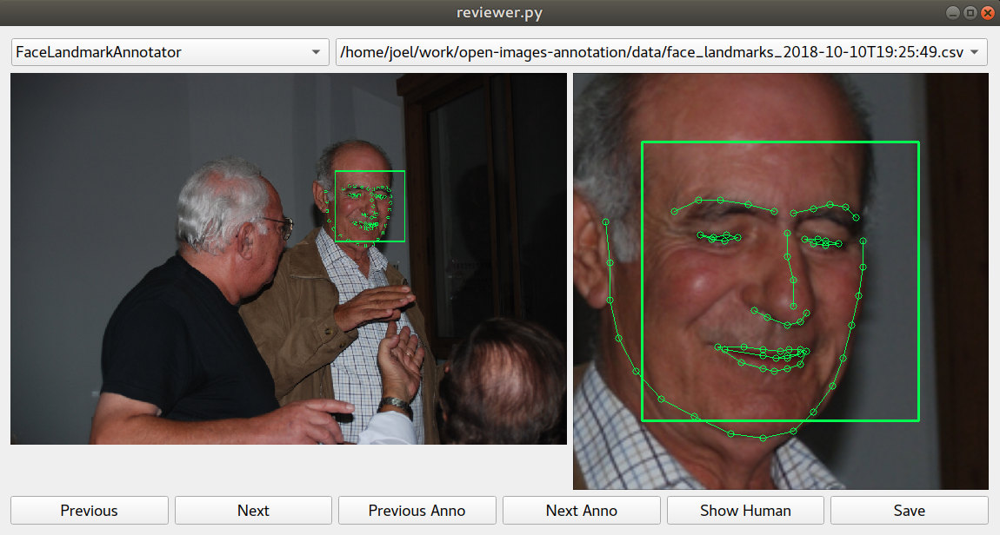

# The Open Images Annotation Project

Google's Open Images dataset is wonderful resource for machine learning.
It is not artificially hampered by licenses that assert non-commercial use.

This makes it ideal for a collaborative annotation effort, including a bootstrapping
approach:

1. Start labelling imagery
2. When there are sufficient new labels, start training a new model
3. If the new model is better on the test set, use it to label images that either haven't been labelled by humans or whose predictions were labelled as no good.
4. Let humans improve errors, or classify model predictions as good or bad. Only good labels will be used for training new models.
5. Return to step 2

## Terminology

- Annotator - a model that takes an image and labels or annotates it somehow.
- Annotation Set - a set of annotations across the whole or some subset of OpenImages. This maybe
  created by a human, by a trained model. If created by a model, some subset of the annotation set
  may have been reviewed by a human.

## Initial Annotators

Initially we will be focussed on:

- specific face detection models for detecting bounding boxes of the subset of images with human faces
- 68pt face landmark tracking on these face bounding boxes

Later we will attempt:
- 5pt face landmark tracking
- general object detection and localisation across the whole dataset
- pixel-wise semantic and instance segmentation, probably using mask-rcnn and using superpixel and filling algorithms to make the UX for annotation correction is easy as possible

## Dependencies

```
sudo apt install pv
pip install -r requirements.txt
```

To build the model trainers, see [here](trainers/README.md)

## Open Images Data

We only used the subset of images with bounding box annotations. You can get the data here:

https://github.com/cvdfoundation/open-images-dataset

(There is a script that tries to sequentially download all the archives at `scripts/open-images-download.sh`)

Once you have it downloaded and made it available, you can update `annotate.settings` with either a single location (`OPEN_IMAGES_DIR`),
or a location by hash prefix (`OPEN_IMAGES_DIR_MAP`). Open Images
distributes archives for each prefix, so this may be more convenient.

## Fetch models and annotations

Annotations and models are stored on S3.

Run `python fetch.py --models` to get the latest models. 
Run `python fetch.py --annotations` to get the latest annotation set for each model. 

## Tools



These are all still specialised for human faces. Some work is required before they can become general
annotation tools. The code structure is attempting to remain general, but for now it's easier to implement
the UI directly. These all use PySide2/Qt.

- `annotator.py` - Show available models, annotation files, and apply them to open images.
- `review.py` - Select an annotation set and review the annotations. You can fix them using the UI,
  and save these to a human annotations file.
- `bulk_annotate.py` - This is a script to iterate through the open-images dataset and apply the latest
  models to each image, creating a new machine generated annotation set.

The intention is to eventually support a web UI so that annotation effort can easily be distributed
across a team of people. [A brief survey of existing tools](ANNOTATION_TOOLS.md) is included.

## Training new models

Once you have new human annotations, and a set of annotations created by the latest model, these
should be merged. The human annotations are always trusted as correct over the model.

There are several types of annotations to consider:
- human annotations, these are created by a human. Assumed to be good.
- machine annotations, rated good by a human. Assumed to be good.
- machine annotations, rated as bad by a human. These are not included for training.
- machine annotations, unrated. These are included in training.

At some point we may use a more clever loss function that weights these annotation types different
(e.g. human created and annotation rated good by humans weighted higher than unrated annotations).

The tooling for this merging process and creating the annotations is
currently somewhat adhoc, and will be documented in detail later.

## License

MIT